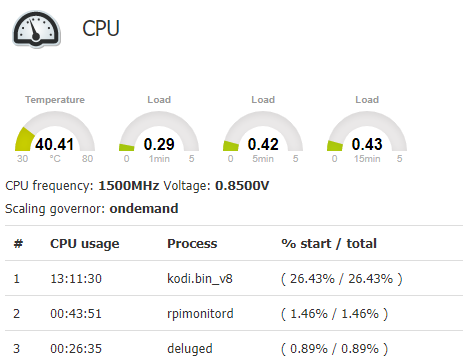
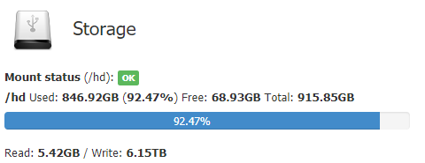

# Templates for [RPi-Monitor](https://github.com/XavierBerger/RPi-Monitor)

Various templates for the awesome RPi-Monitor tool by Xavier Berger. Please check their [original repo](https://github.com/XavierBerger/RPi-Monitor) and the [original docs](https://xavierberger.github.io/RPi-Monitor-docs/index.html) to understand more about this tool.

The templates provided in this repo were not reviewed nor endorsed by Xavier Berger. Use them at your own will.


## How to use these templates

To install all the templates provided by this tool, just execute the `install.sh` file.
The user executing the script should have permission to create files in the RPi Monitor's templates folder as well as to modify the `data.conf` file in the RPi Monitor folder. This usually means executing as `sudo`:
```bash
/RPi-Monitor-Templates$ sudo ./install.sh
```
This installation uses the default parameters for all templates. To pass specific templates please use the individual installer as described below for each of the templates.


Every template is inside its own subfolder with its own `install.sh` file, so if you prefer to install a specific template, just open the folder and execute its install file:
```bash
$ cd cpu_load_temperature
$ ./install.sh
```

All installers expect the RPi Monitor templates to be located in the default `/etc/rpimonitor/template` folder.
Should you have the templates in a different directory please change the `DIR_RPIMONITOR_TEMPLATES` variable inside each `install.sh` file before executing it.


## Templates

### CPU Load + Temperature
This template merges together the default CPU (`cpu.conf`) and Temperature (`temperature.conf`) templates, and (optionally) enables the `top3` addon.
To avoid enabling the `top3` addon, use `notop3` as the first parameter of the `install.sh` file: (only works when installing this specific template. When installing all templates top3 is always enabled)
```bash
$ cd cpu_load_temperature
$ ./install.sh notop3
```




### HD (Storage)
This template monitors a single external USB HD. By default it expects the HD to be the `sda1` device mounted in `/hd`.
Any different configuration can be passed as arguments to the install script (only works when installing this specific template):
```bash
$ cd hd
$ ./install.sh /mnt/mydevice sda2
```




# Issues
When reporting issues, please zip the folder `/etc/rpimonitor` of your instalation and describe which installers were executed.
This folder is usually very small and contains only a bunch of config files without any personal information. It also does not include any collected data.
